# **Kisan App**
The main purpose of this project is to provide information to the **Farmers** such as agricultural related news, government schemes for the farmers and how to apply for those schemes, crop information articles and to chat with **Agricultural Expert** in case of any doubts. **Admin** manages the users viz. **Farmer** and **Agricultural Expert**.

This project is developed using Flutter and Firebase. You can download the apk from [here].(https://drive.google.com/file/d/1t52hbVml8M1zMlaa04sg2OG7qeQetOoU/view?usp=sharing)

## App Screenshots

  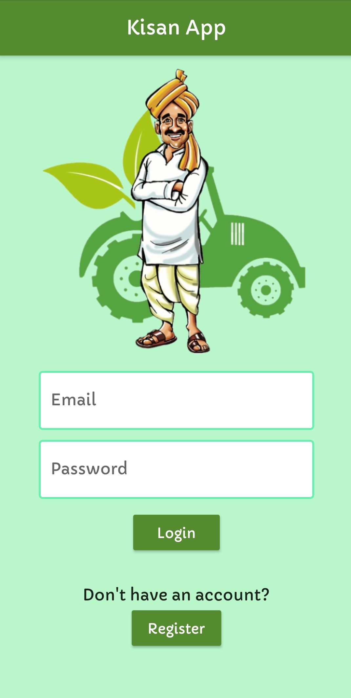
  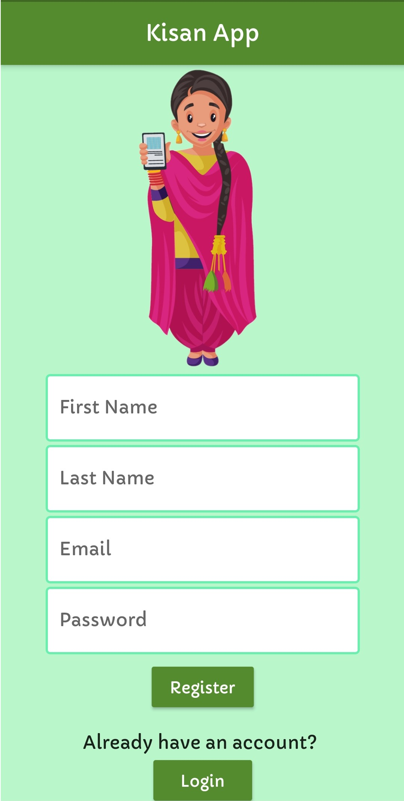
  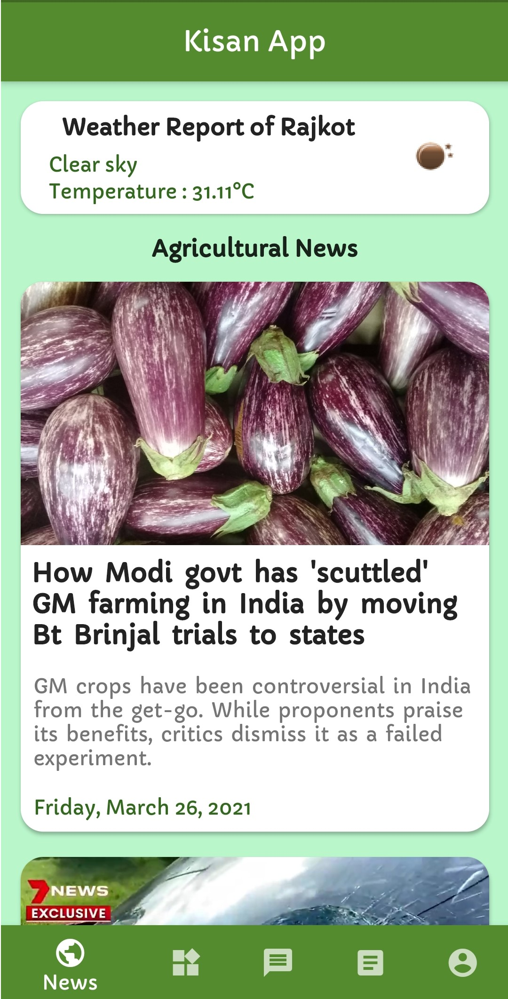

  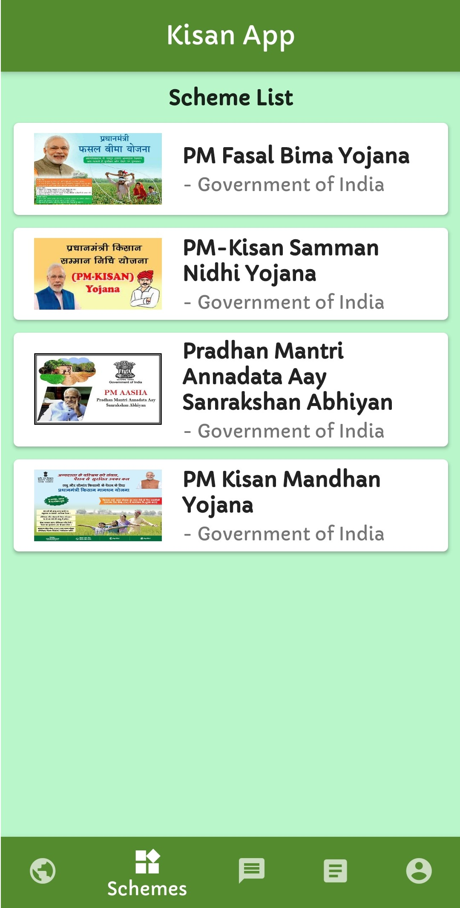
  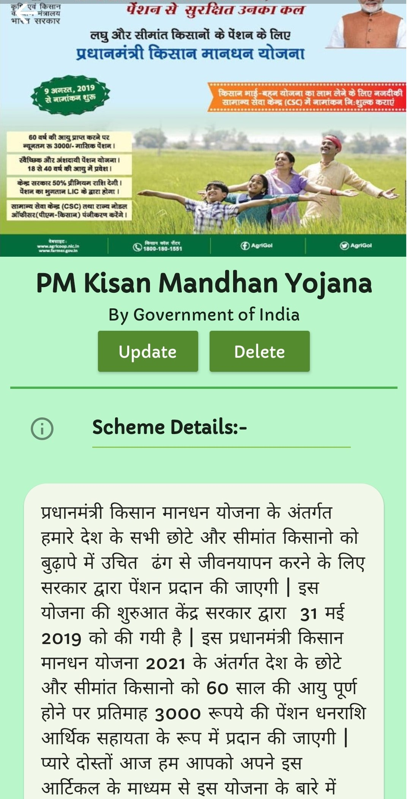
  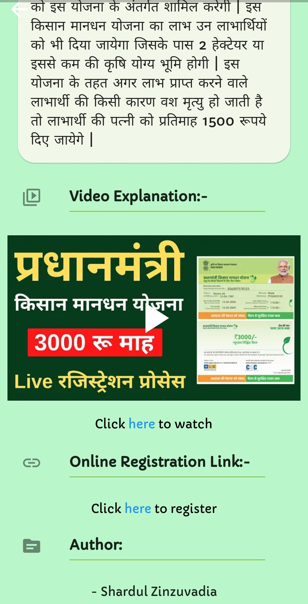

  
  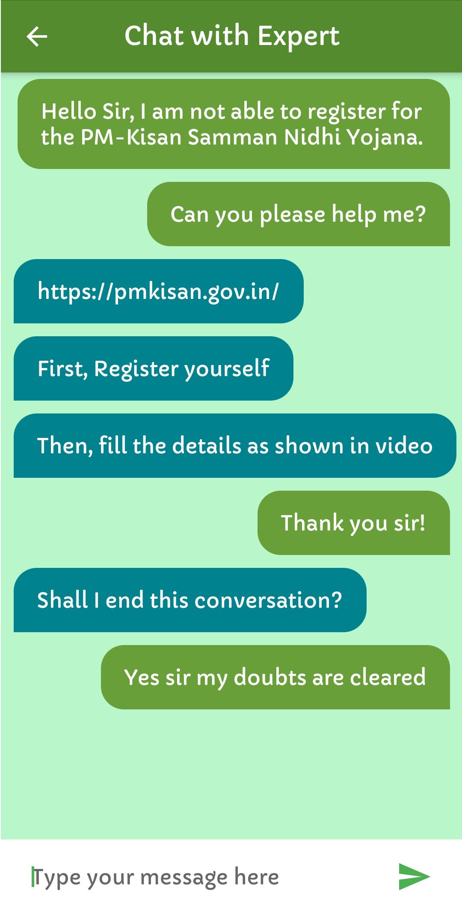
  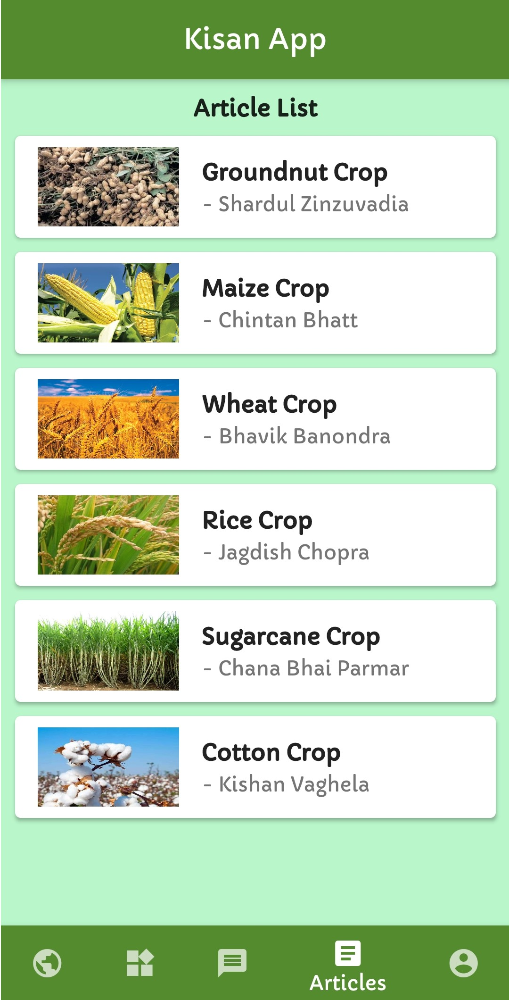
  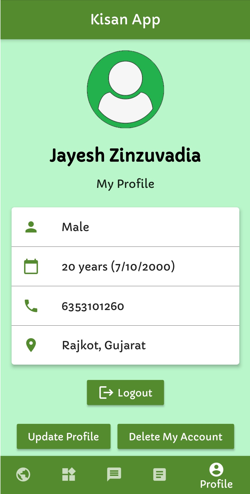  

  
  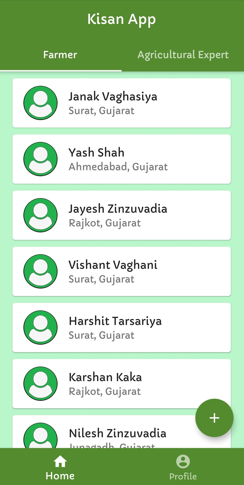
  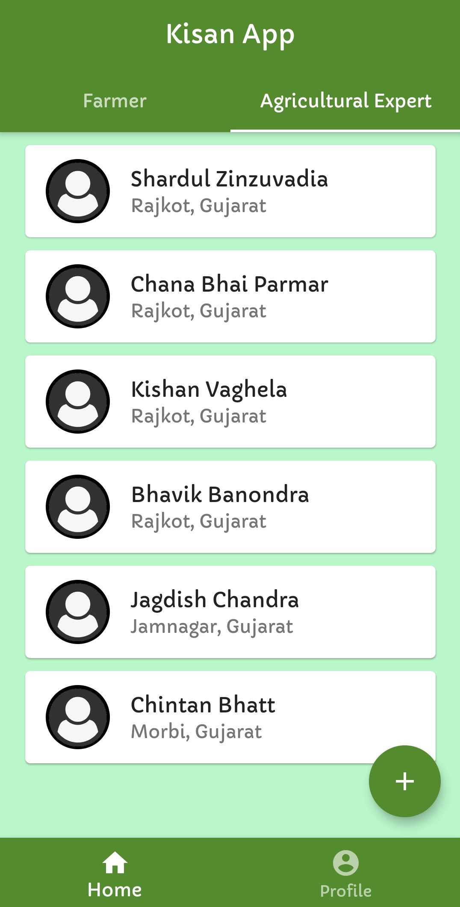
  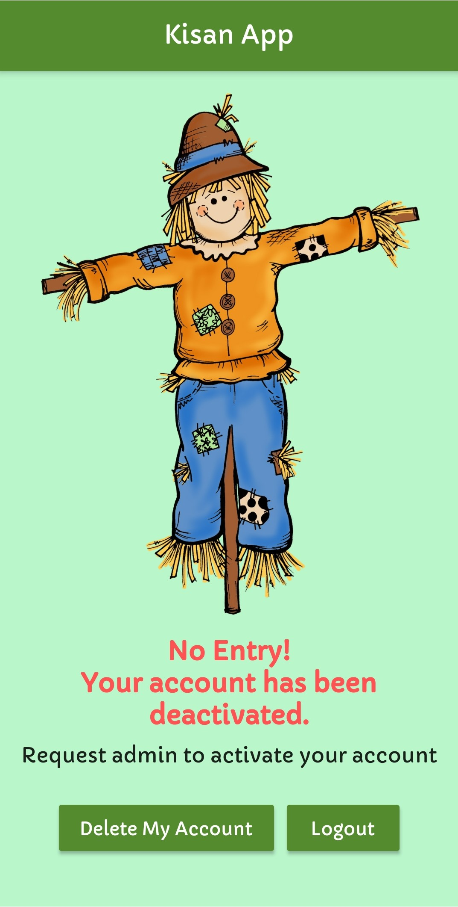  

## How to setup and run this project

My flutter version is **1.22.5** (before null safety). So, if you are using latest version, then you'll have to do the necessary changes in the above code.

1. Install the Flutter SDK and Android Studio (if not installed) and then create a fresh new project.
    * A few resources to get you started if this is your first Flutter project:
        - [Lab: Write your first Flutter app](https://flutter.dev/docs/get-started/codelab)
        - [Cookbook: Useful Flutter samples](https://flutter.dev/docs/cookbook)        
    * For help getting started with Flutter, view our [online documentation](https://flutter.dev/docs), which offers tutorials, samples, guidance on mobile development, and a full API reference.
2. Now, integrate Flutter project with Firebase - [Add Firebase to your Flutter app](https://firebase.google.com/docs/flutter/setup)
3. Place the above files and directories in the same structure as above.
4. Download the packages from the `pubspec.yaml` file.
5. Run the `main.dart` file or **flutter run** command. Now, the app will build and start running on your mobile or emulator.